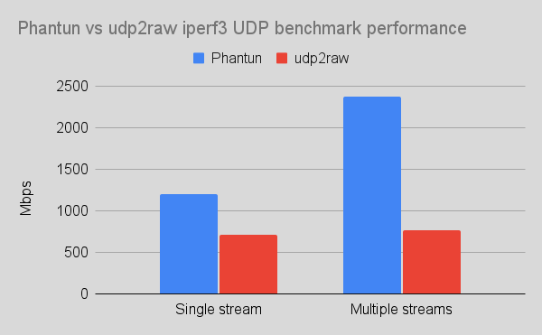
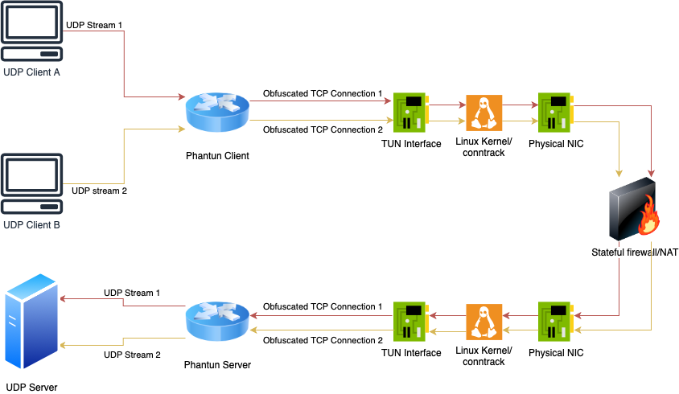
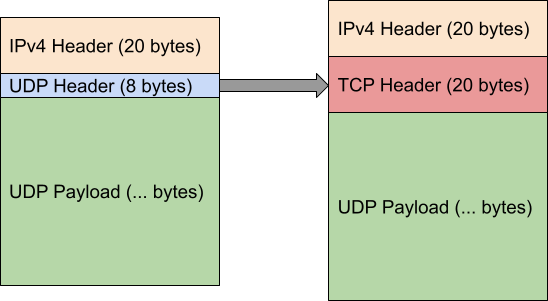

# Phantun

A lightweight and fast UDP to TCP obfuscator.


Table of Contents
=================

* [Phantun](#phantun)
* [Latest release](#latest-release)
* [Overview](#overview)
* [Usage](#usage)
    * [1. Enable Kernel IP forwarding](#1-enable-kernel-ip-forwarding)
    * [2. Add required firewall rules](#2-add-required-firewall-rules)
        * [Client](#client)
            * [Using nftables](#using-nftables)
            * [Using iptables](#using-iptables)
        * [Server](#server)
            * [Using nftables](#using-nftables)
            * [Using iptables](#using-iptables)
    * [3. Run Phantun binaries as non-root (Optional)](#3-run-phantun-binaries-as-non-root-optional)
    * [4. Start Phantun daemon](#4-start-phantun-daemon)
        * [Server](#server)
        * [Client](#client)
* [MTU overhead](#mtu-overhead)
    * [MTU calculation for WireGuard](#mtu-calculation-for-wireguard)
* [Version compatibility](#version-compatibility)
* [Documentations](#documentations)
* [Performance](#performance)
* [Future plans](#future-plans)
* [Compariation to udp2raw](#compariation-to-udp2raw)
* [License](#license)

# Latest release

[v0.7.0](https://github.com/dndx/phantun/releases/tag/v0.7.0)

# Overview

Phantun is a project that obfuscated UDP packets into TCP connections. It aims to
achieve maximum performance with minimum processing and encapsulation overhead.

It is commonly used in environments where UDP is blocked/throttled but TCP is allowed through.

Phantun simply converts a stream of UDP packets into obfuscated TCP stream packets. The TCP stack
used by Phantun is designed to pass through most L3/L4 stateful/stateless firewalls/NAT
devices. It will **not** be able to pass through L7 proxies.
However, the advantage of this approach is that none of the common UDP over TCP performance killer
such as retransmissions and flow control will occur. The underlying UDP properties such as
out-of-order delivery are fully preserved even if the connection ends up looking like a TCP
connection from the perspective of firewalls/NAT devices.

Phantun means Phantom TUN, as it is an obfuscator for UDP traffic that does just enough work
to make it pass through stateful firewall/NATs as TCP packets.

Phantun is written in 100% safe Rust. It has been optimized extensively to scale well on multi-core
systems and has no issue saturating all available CPU resources on a fast connection.
See the [Performance](#performance) section for benchmarking results.




# Usage

For the example below, it is assumed that **Phantun Server** listens for incoming Phantun Client connections at
port `4567` (the `--local` option for server), and it forwards UDP packets to UDP server at `127.0.0.1:1234`
(the `--remote` option for server).

It is also assumed that **Phantun Client** listens for incoming UDP packets at
`127.0.0.1:1234` (the `--local` option for client) and connects to Phantun Server at `10.0.0.1:4567`
(the `--remote` option for client).

Phantun creates TUN interface for both the Client and Server. For **Client**, Phantun assigns itself the IP address
`192.168.200.2` and `fcc8::2` by default.
For **Server**, it assigns `192.168.201.2` and `fcc9::2` by default. Therefore, your Kernel must have
IPv4/IPv6 forwarding enabled and setup appropriate iptables/nftables rules for NAT between your physical
NIC address and Phantun's Tun interface address.

You may customize the name of Tun interface created by Phantun and the assigned addresses. Please
run the executable with `-h` options to see how to change them.

Another way to help understand this network topology (please see the diagram above for an illustration of this topology):

Phantun Client is like a machine with private IP address (`192.168.200.2`/`fcc8::2`) behind a router.
In order for it to reach the Internet, you will need to SNAT the private IP address before it's traffic
leaves the NIC.

Phantun Server is like a server with private IP address (`192.168.201.2`/`fcc9::2`) behind a router.
In order to access it from the Internet, you need to `DNAT` it's listening port on the router
and change the destination IP address to where the server is listening for incoming connections.

In those cases, the machine/iptables running Phantun acts as the "router" that allows Phantun
to communicate with outside using it's private IP addresses.

As of Phantun v0.4.1, IPv6 is fully supported for both TCP and UDP sides.
To specify an IPv6 address, use the following format: `[::1]:1234` with
the command line options. Resolving AAAA record is also supported. Please run the program
with `-h` to see detailed options on how to control the IPv6 behavior.

[Back to TOC](#table-of-contents)

## 1. Enable Kernel IP forwarding

Edit `/etc/sysctl.conf`, add `net.ipv4.ip_forward=1` and run `sudo sysctl -p /etc/sysctl.conf`.

<details>
  <summary>IPv6 specific config</summary>

  `net.ipv6.conf.all.forwarding=1` will need to be set as well.
</details>

[Back to TOC](#table-of-contents)

## 2. Add required firewall rules


### Client

Client simply need SNAT enabled on the physical interface to translate Phantun's address into
one that can be used on the physical network. This can be done simply with masquerade.

Note: change `eth0` to whatever actual physical interface name is

[Back to TOC](#table-of-contents)

#### Using nftables

```
table inet nat {
    chain postrouting {
        type nat hook postrouting priority srcnat; policy accept;
        iifname tun0 oif eth0 masquerade
    }
}
```

Note: The above rule uses `inet` as the table family type, so it is compatible with
both IPv4 and IPv6 usage.

[Back to TOC](#table-of-contents)

#### Using iptables

```
iptables -t nat -A POSTROUTING -o eth0 -j MASQUERADE
ip6tables -t nat -A POSTROUTING -o eth0 -j MASQUERADE
```

[Back to TOC](#table-of-contents)

### Server

Server needs to DNAT the TCP listening port to Phantun's TUN interface address.

Note: change `eth0` to whatever actual physical interface name is and `4567` to
actual TCP port number used by Phantun server

[Back to TOC](#table-of-contents)

#### Using nftables

```
table inet nat {
    chain prerouting {
        type nat hook prerouting priority dstnat; policy accept;
        iif eth0 tcp dport 4567 dnat ip to 192.168.201.2
        iif eth0 tcp dport 4567 dnat ip6 to fcc9::2
    }
}
```

[Back to TOC](#table-of-contents)

#### Using iptables

```
iptables -t nat -A PREROUTING -p tcp -i eth0 --dport 4567 -j DNAT --to-destination 192.168.201.2
ip6tables -t nat -A PREROUTING -p tcp -i eth0 --dport 4567 -j DNAT --to-destination fcc9::2
```

[Back to TOC](#table-of-contents)

## 3. Run Phantun binaries as non-root (Optional)

It is ill-advised to run network facing applications as root user. Phantun can be run fully
as non-root user with the `cap_net_admin` capability.

```
sudo setcap cap_net_admin=+pe phantun_server
sudo setcap cap_net_admin=+pe phantun_client
```


[Back to TOC](#table-of-contents)

## 4. Start Phantun daemon

**Note:** Run Phantun executable with `-h` option to see full detailed options.

[Back to TOC](#table-of-contents)

### Server

Note: `4567` is the TCP port Phantun should listen on and must corresponds to the DNAT
rule specified above. `127.0.0.1:1234` is the UDP Server to connect to for new connections.

```
RUST_LOG=info /usr/local/bin/phantun_server --local 4567 --remote 127.0.0.1:1234
```

Or use host name with `--remote`:

```
RUST_LOG=info /usr/local/bin/phantun_server --local 4567 --remote example.com:1234
```

Note: Server by default assigns both IPv4 and IPv6 private address to the Tun interface.
If you do not wish to use IPv6, you can simply skip creating the IPv6 DNAT rule above and
the presence of IPv6 address on the Tun interface should have no side effect to the server.

[Back to TOC](#table-of-contents)

### Client

Note: `127.0.0.1:1234` is the UDP address and port Phantun should listen on. `10.0.0.1:4567` is
the Phantun Server to connect.

```
RUST_LOG=info /usr/local/bin/phantun_client --local 127.0.0.1:1234 --remote 10.0.0.1:4567
```

Or use host name with `--remote`:

```
RUST_LOG=info /usr/local/bin/phantun_client --local 127.0.0.1:1234 --remote example.com:4567
```

<details>
  <summary>IPv6 specific config</summary>

  ```
  RUST_LOG=info /usr/local/bin/phantun_client --local 127.0.0.1:1234 --remote [fdxx::1234]:4567
  ```

  Domain name with AAAA record is also supported.
</details>

[Back to TOC](#table-of-contents)

# MTU overhead

Phantun aims to keep tunneling overhead to the minimum. The overhead compared to a plain UDP packet
is the following (using IPv4 below as an example):

**Standard UDP packet:** `20 byte IP header + 8 byte UDP header = 28 bytes`

**Obfuscated packet:** `20 byte IP header + 20 byte TCP header = 40 bytes`


Note that Phantun does not add any additional header other than IP and TCP headers in order to pass through
stateful packet inspection!

Phantun's additional overhead: `12 bytes`. In other words, when using Phantun, the usable payload for
UDP packet is reduced by 12 bytes. This is the minimum overhead possible when doing such kind
of obfuscation.



[Back to TOC](#table-of-contents)

## MTU calculation for WireGuard

For people who use Phantun to tunnel [WireGuard®](https://www.wireguard.com) UDP packets, here are some guidelines on figuring
out the correct MTU to use for your WireGuard interface.

```
WireGuard MTU = Interface MTU - IPv4 header (20 bytes) - TCP header (20 bytes) - WireGuard overhead (32 bytes)
```

or

```
WireGuard MTU = Interface MTU - IPv6 header (40 bytes) - TCP header (20 bytes) - WireGuard overhead (32 bytes)
```

For example, for a Ethernet interface with 1500 bytes MTU, the WireGuard interface MTU should be set as:

IPv4: `1500 - 20 - 20 - 32 = 1428 bytes`
IPv6: `1500 - 40 - 20 - 32 = 1408 bytes`

The resulted Phantun TCP data packet will be 1500 bytes which does not exceed the
interface MTU of 1500. Please note it is strongly recommended to use the same interface
MTU for both ends of a WireGuard tunnel, or unexpected packet loss may occur and these issues are
generally very hard to troubleshoot.

[Back to TOC](#table-of-contents)

# Version compatibility

While the TCP stack is fairly stable, the general expectation is that you should run same minor versions
of Server/Client of Phantun on both ends to ensure maximum compatibility.

[Back to TOC](#table-of-contents)

# Documentations

For users who wish to use `fake-tcp` library inside their own project, refer to the documentations for the library at:
[https://docs.rs/fake-tcp](https://docs.rs/fake-tcp).

[Back to TOC](#table-of-contents)

# Performance

Performance was tested on 2 AWS `t4g.xlarge` instances with 4 vCPUs and 5 Gb/s NIC over LAN. `nftables` was used to redirect
UDP stream of `iperf3` to go through the Phantun/udp2raw tunnel between two test instances and MTU has been tuned to avoid fragmentation.

Phantun `v0.3.2` and `udp2raw_arm_asm_aes` `20200818.0` was used. These were the latest release of both projects as of Apr 2022.

Test command: `iperf3 -c <IP> -p <PORT> -R -u -l 1400 -b 1000m -t 30 -P 5`

| Mode                                                                            | Send Speed     | Receive Speed  | Overall CPU Usage                                   |
|---------------------------------------------------------------------------------|----------------|----------------|-----------------------------------------------------|
| Direct (1 stream)                                                               | 3.00 Gbits/sec | 2.37 Gbits/sec | 25% (1 core at 100%)                                |
| Phantun (1 stream)                                                              | 1.30 Gbits/sec | 1.20 Gbits/sec | 60% (1 core at 100%, 3 cores at 50%)                |
| udp2raw (`cipher-mode=none` `auth-mode=none` `disable-anti-replay`) (1 stream)  | 1.30 Gbits/sec | 715 Mbits/sec  | 40% (1 core at 100%, 1 core at 50%, 2 cores idling) |
| Direct connection (5 streams)                                                   | 5.00 Gbits/sec | 3.64 Gbits/sec | 25% (1 core at 100%)                                |
| Phantun (5 streams)                                                             | 5.00 Gbits/sec | 2.38 Gbits/sec | 95% (all cores utilized)                            |
| udp2raw (`cipher-mode=none` `auth-mode=none` `disable-anti-replay`) (5 streams) | 5.00 Gbits/sec | 770 Mbits/sec  | 50% (2 cores at 100%)                               |

Writeup on some of the techniques used in Phantun to achieve this performance result: [Writing Highly Efficient UDP Server in Rust](https://idndx.com/writing-highly-efficient-udp-server-in-rust/).

[Back to TOC](#table-of-contents)

# Future plans

* Load balancing a single UDP stream into multiple TCP streams
* Integration tests
* Auto insertion/removal of required firewall rules

[Back to TOC](#table-of-contents)

# Compariation to udp2raw
[udp2raw](https://github.com/wangyu-/udp2raw-tunnel) is another popular project by [@wangyu-](https://github.com/wangyu-)
that is very similar to what Phantun can do. In fact I took inspirations of Phantun from udp2raw. The biggest reason for
developing Phantun is because of lack of performance when running udp2raw (especially on multi-core systems such as Raspberry Pi).
However, the goal is never to be as feature complete as udp2raw and only support the most common use cases. Most notably, UDP over ICMP
and UDP over UDP mode are not supported and there is no anti-replay nor encryption support. The benefit of this is much better
performance overall and less MTU overhead because lack of additional headers inside the TCP payload.

Here is a quick overview of comparison between those two to help you choose:

|                                                  |    Phantun    |      udp2raw      |
|--------------------------------------------------|:-------------:|:-----------------:|
| UDP over FakeTCP obfuscation                     |       ✅       |         ✅         |
| UDP over ICMP obfuscation                        |       ❌       |         ✅         |
| UDP over UDP obfuscation                         |       ❌       |         ✅         |
| Multi-threaded                                   |       ✅       |         ❌         |
| Throughput                                       |     Better    |        Good       |
| Layer 3 mode                                     | TUN interface | Raw sockets + BPF |
| Tunneling MTU overhead                           |    12 bytes   |      44 bytes     |
| Seprate TCP connections for each UDP connection  | Client/Server |    Server only    |
| Anti-replay, encryption                          |       ❌       |         ✅         |
| IPv6                                             |       ✅       |          ✅        |

[Back to TOC](#table-of-contents)

# License

Copyright 2021-2024 Datong Sun (dndx@idndx.com)

Licensed under the Apache License, Version 2.0 <LICENSE-APACHE or
[https://www.apache.org/licenses/LICENSE-2.0](https://www.apache.org/licenses/LICENSE-2.0)> or the MIT license
<LICENSE-MIT or [https://opensource.org/licenses/MIT](https://opensource.org/licenses/MIT)>, at your
option. Files in the project may not be
copied, modified, or distributed except according to those terms.

[Back to TOC](#table-of-contents)

